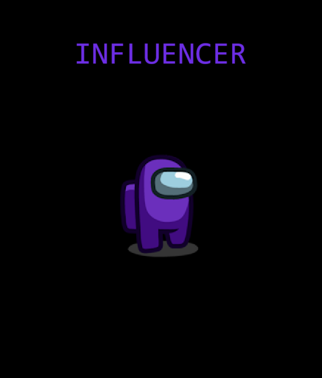
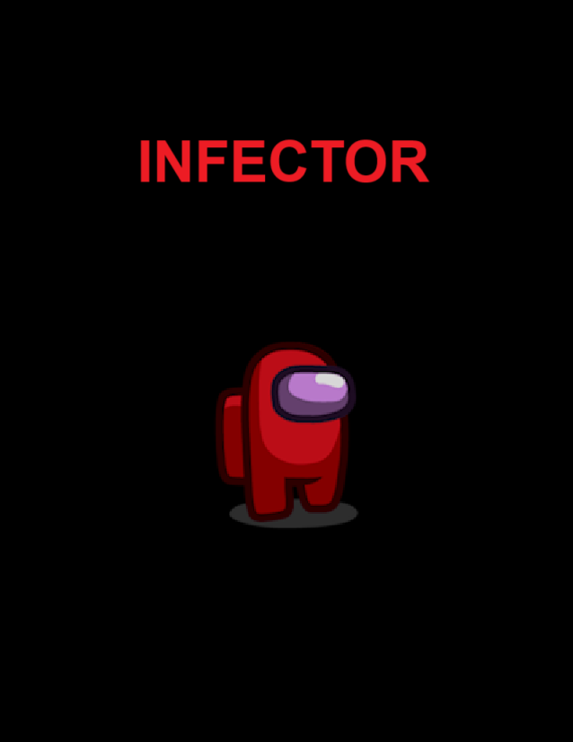
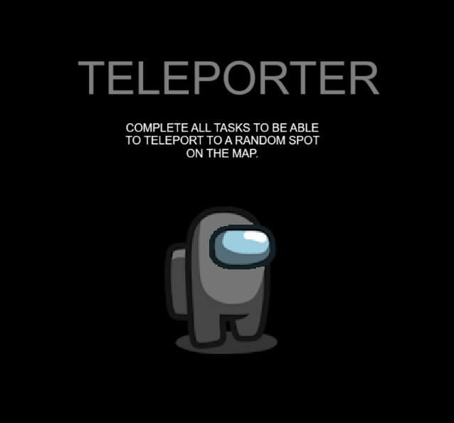

# Mega Roles Mod
A mod with some roles that could be added in future Among Us updates. Crewmate AND  Neutral roles will show up as an Engineer while Impostor ones show up as Impostor.

Influencer is a crewmate role that can take photos(until set limit) to reveal them in a meeting and potentially catch Neutrals and Impostors. Try to be in group with somebody until you gather enough information for the crew and some Neutrals to them winning with you.

Infector is an impostor role that can poison players to eliminate them with a set delay after a meeting ending. Don't walk back to missed players to poison them, that will be sus.

Evil ghost is a neutral role that can slow down players by a set multiplier while evil ghost is alive. Curse players to blind and eliminate(after a short delay so blindness is useful) when evil ghost is d*ad. Curse everyone to win alone before crewmates or impostors reach their win requirement.

Teleporter is a neutral role that can teleport to a random room in the map by completing it's tasks. Use your multi-use ability to stay alive until the end to win with either of 2 other fractions that reached win req.

